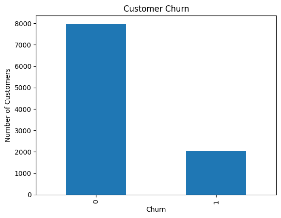
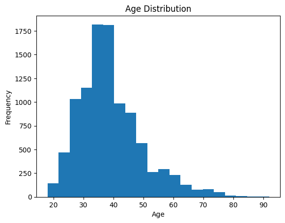
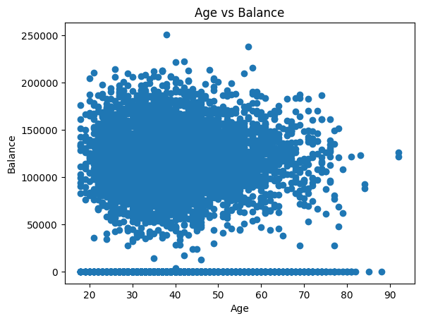

# 🏦 Bank Customer Churn Analysis & Prediction

[](https://www.python.org/)
[](https://scikit-learn.org/)
[](LICENSE)

An end-to-end Machine Learning project to analyze bank customer demographics and account activity to predict customer churn. 

---

## 📋 Table of Contents
- [Domain & Problem Statement](#-domain--problem-statement)
- [Key Features](#-key-features)
- [Technologies Used](#-technologies-used)
- [Project Overview](#-project-overview)
- [Dataset Specifications](#-dataset-specifications)
- [Exploratory Data Analysis (EDA)](#-exploratory-data-analysis-eda)
- [Data Preprocessing](#-data-preprocessing)
- [Model Training & Evaluation](#-model-training--evaluation)
- [Making Predictions](#-making-predictions)
- [How to Run](#-how-to-run)

---

## 🌐 Domain & Problem Statement

### **Domain:**
* **Finance & Banking**: Customer relationship management and churn analytics.

### **Problem Statement:**
* Customer churn occurs when customers stop using a bank's services. Acquiring new customers costs significantly more than retaining existing ones. 
* This project aims to build a classification model that predicts whether a customer is likely to exit the bank (`churn = 1`) or stay (`churn = 0`) using customer attributes like credit score, age, balance, tenure, and product usage. By identifying churn risks early, the bank can offer targeted loyalty incentives to improve retention rates.

---

## ⚡ Key Features

* **Exploratory Data Analysis (EDA):** Deep dive into customer behaviors (Age distributions, Churn correlations, Balance vs. Age patterns).
* **Robust Preprocessing Pipeline:** Handled categorical encoding (One-Hot Encoding) and standard normalization scaling for numerical attributes.
* **Predictive Classifier:** Implemented and evaluated a Logistic Regression model to classify churn with high validation scores.
* **Customer Inference Example:** Quick inference test to predict churn probability for new/unseen customer profiles.

---

## 🛠️ Technologies Used

* **Language:** Python 3.8+
* **Data Handling:** Pandas, NumPy
* **Visualization:** Matplotlib, Seaborn
* **Machine Learning:** Scikit-Learn (preprocessing, scaling, linear model, metrics)
* **Environment:** Jupyter Notebook / Google Colab

---

## 🔍 Project Overview

The objective of this project is to identify key factors that drive bank customer churn and build a predictive model. The workflow includes:
1. **Data Cleaning:** Identifying missing values, duplicates, and analyzing data types.
2. **Exploratory Data Analysis (EDA):** Visualizing distributions, correlations, and checking the balance of the target variable (`churn`).
3. **Data Encoding & Scaling:** Converting categorical features (Country, Gender) into numerical values and scaling data with `StandardScaler`.
4. **Model Training:** Fitting a **Logistic Regression** classifier on historical customer data.
5. **Evaluation:** Assessing performance using Accuracy, Confusion Matrix, and Precision/Recall/F1-scores.

---

## 📊 Dataset Specifications

The analysis uses the [Bank Customer Churn Prediction.csv](Bank%20Customer%20Churn%20Prediction.csv) dataset, which contains **10,000 rows** and **12 columns**:

| Column Name | Data Type | Description |
| :--- | :--- | :--- |
| `customer_id` | Integer | Unique identifier for each customer |
| `credit_score` | Integer | Customer's credit score |
| `country` | Categorical | Country of residence (France, Spain, Germany) |
| `gender` | Categorical | Customer gender (Male, Female) |
| `age` | Integer | Customer's age |
| `tenure` | Integer | Number of years the customer has been with the bank |
| `balance` | Float | Customer's bank account balance |
| `products_number` | Integer | Number of bank products the customer uses |
| `credit_card` | Binary (0/1) | Whether the customer owns a credit card |
| `active_member` | Binary (0/1) | Whether the customer is an active bank member |
| `estimated_salary`| Float | Customer's estimated annual salary |
| **`churn`** *(Target)*| Binary (0/1) | Whether the customer closed their account (1) or stayed (0) |

---

## 📊 Exploratory Data Analysis (EDA)

Before building the predictive model, we explored the dataset to understand the characteristics and distributions of the features. Here are some of the key insights:

### 1. Customer Churn Distribution
The dataset is imbalanced, with approximately **20.4%** of the customers churned (`1`) and **79.6%** retained (`0`).
<p align="center">
  
</p>

### 2. Age Distribution
Most of the bank's customers fall within the **30 to 45** age bracket, which is a key demographic group for financial products.
<p align="center">
  
</p>

### 3. Age vs. Balance
Analyzing the relationship between customer age and account balance shows a wide distribution of balances across all age groups, with a significant cluster of customers having zero balance.
<p align="center">
  
</p>

---

## ⚙️ Data Preprocessing

To prepare the dataset for machine learning models, the following pipeline was implemented:
- **Categorical Feature Encoding:** Applied One-Hot Encoding to `country` and `gender` features, dropping the first category to avoid multicollinearity (`country_Germany`, `country_Spain`, and `gender_Male` are created).
- **Target Splitting:** Separated the features ($X$) and the target variable ($y$ = `churn`).
- **Feature Scaling:** Applied `StandardScaler` to normalize numerical features so that the models aren't biased towards larger-magnitude values.
- **Train-Test Split:** Split the dataset into **80% training data** (8,000 samples) and **20% testing data** (2,000 samples) to ensure reliable evaluation.

---

## 📈 Model Training & Evaluation

A **Logistic Regression** model was trained using `scikit-learn`.

### **Performance Metrics on Test Set:**
- **Accuracy:** **`81.05%`**

#### **Classification Report:**
```text
              precision    recall  f1-score   support

 No Churn (0)       0.83      0.96      0.89      1607
   Churn  (1)       0.55      0.20      0.29       393

    accuracy                           0.81      2000
   macro avg       0.69      0.58      0.59      2000
weighted avg       0.78      0.81      0.77      2000
```

#### **Confusion Matrix:**
* **True Negatives (Correctly predicted retained):** `1543`
* **False Positives (Incorrectly predicted churned):** `64`
* **False Negatives (Incorrectly predicted retained):** `315`
* **True Positives (Correctly predicted churned):** `78`

---

## 🔮 Making Predictions

The model can predict the churn probability of any new customer. Below is an example of running predictions in Python:

```python
import numpy as np
from sklearn.preprocessing import StandardScaler
from sklearn.linear_model import LogisticRegression

# Example new customer details:
# customer_id: 10001, credit_score: 650, age: 45, tenure: 5, balance: 120000, 
# products_number: 2, credit_card: 1, active_member: 1, estimated_salary: 80000,
# country_Germany: 0, country_Spain: 1, gender_Male: 1
new_customer = np.array([[10001, 650, 45, 5, 120000, 2, 1, 1, 80000, 0, 1, 1]])

# Scale the feature values using the fitted scaler
new_customer_scaled = scaler.transform(new_customer)

# Make prediction
prediction = model.predict(new_customer_scaled)

if prediction[0] == 1:
    print("Prediction: Customer will Churn")
else:
    print("Prediction: Customer will Not Churn")
```

---

## 🚀 How to Run

### **Prerequisites**
Make sure you have Python installed, along with the required libraries:
```bash
pip install numpy pandas matplotlib scikit-learn jupyter
```

### **Running the Notebook**
1. Clone the repository:
   ```bash
   git clone https://github.com/Prathibaa07/Bank_Churn_Analysis.git
   cd Bank_Churn_Analysis
   ```
2. Start Jupyter Notebook:
   ```bash
   jupyter notebook
   ```
3. Open `Bank_Churn_Analysis.ipynb` and run all cells to reproduce the analysis.
